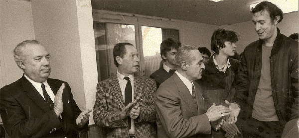
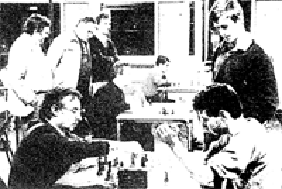
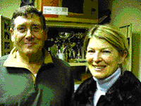
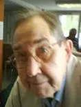
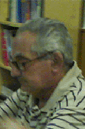

## Les débuts

Le président fondateur M. WACHMAN Jacob de 1982 à 1986
(à droite, serrant la main à un “grand joueur très connu”, avec derrière lui M. Georges MEISNER, trésorier fondateur de l'époque).

M. Dominique MOUTARDIER second président de 1986 à 1988, le barbu de droite remettant une coupe à M. Mohamed BELHAMINE
(à gauche le futur président Jean Pierre HUBSCHMANN de 1989 à 2004).

M. Gérard TALLEUX (assis à gauche) troisième président de 1988 à 1989

Vue de la salle et de son quatrième président (1989-2004) Jean Pierre HUBSCHMANN (à droite) surveillant le bon déroulement des jeux.

Évolution du logo du club au fil des années

## Le cercle d'echecs de Sèvres change de nom

Martine Chavatte, Présidente des AVF de Sèvres et Guy Wanner, cinquième Président de Sèvres-Echecs

Le cercle « Sèvres-Echecs », créé en 1982, qui compte cette présente saison trente-huit adhérents, va accueillir pour la saison prochaine les joueurs amis du club du Petit-Roque de Ville-d'Avray dont monsieur Pascal Champagne en est le Président depuis 2000. Avec leur accord et à partir du 1er juillet 2007, « Sèvres-Echecs », prendra le nom de « Le Petit-Roque de Sèvres Ville d'Avray » ou plus communément celui de « Petit-Roque SVA ».

La domiciliation du Siège Social restera inchangée et demeurera attachée à la commune  de Sèvres. Il en est de même du Bureau et du comité directeur.

Dagovéraniens et Sévriens se partageront alors les ressources de la salle Pierre Midrin sise au 5 de la rue Pierre Midrin à Sèvres, pour entamer la saison échiquéenne 2007-2008 avec un effectif potentiel d'une cinquantaine de joueurs, dont une quinzaine de jeunes benjamins, poussins et pupilles.

Pour mémoire...

Sèvres-Echecs a été fondé le 9 septembre 1982 par Jacob Wachman, aujourd'hui décédé. Il se distingue actuellement par des actions de promotion et de diffusion de l'enseignement des échecs, tant au sein du club qu'à l'extérieur, et plus particulièrement dans les écoles sévriennes. Le pourquoi du changement de nom : Un retour aux sources.

« Le Petit-Roque de Ville-d'Avray » est une émanation de « Le Petit-Roque de Sèvres-Ville d'Avray », club qui a été formé le 9 janvier 1945 et qui avait son Siège Social d'alors, ... à Sèvres, place de la gare de Sèvres-Ville d'Avray, dans la maison du glacier Rouet (la pharmacie actuelle). Ce club de l'après guerre, a été créé et animé entre autres par deux tandems de père-fils aux noms aussi prestigieux que Alain et Boris Vian ou Jean et François Rostand. Dans l'excellent article de François Voituron, ancien licencié du club « Le Petit-Roque de Ville-d'Avray », nous y apprenons que le talentueux Yehudi Ménuhin, qui fut citoyen de Ville d'Avray de 1930 à 1935, avait rendu une visite occasionnelle à ce cercle d'amis, amateurs du jeu d'échecs.

L'union faisant la force, la renommée des 2 cercles n'étant plus à faire sur Paris et sa région, voire au-delà. Nous essaierons de conserver l'esprit d'équipe qui anime nos passionnés des échecs, de mettre toutes nos forces au service de tous ceux qui souhaitent apprendre, progresser, concourir, et pour certains évaluer leur compétence, leurs capacités de réflexion et d'analyse.

Bernard DO NGOC THANH
Secrétaire de Sèvres-Echecs
– Mardi 29 mai 2007

## Membres d'Honneur

+ Dominique Moutardier, Président de Sèvres Echecs de 1986 à 1988

+ Jean-Pierre Hubschmann

Vice-président de 1984 à 1990, Président de Sèvres-Echecs de 1990 à 2004, membre du comité directeur jusqu'à son décès le 26 janvier 2012. Trésorier du Comité d'échecs des Hauts de Seine de 1995 à 2006.  Diplôme de Lauréat 2011 décerné par monsieur Kosciusko-Morizet, Maire de Sèvres en novembre 2011.

+ Istvan Szanto

Trésorier de 1985 à 2009.