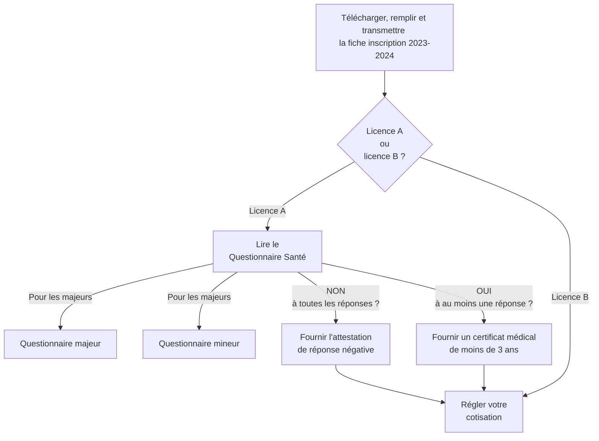

Adhésion au club:

+ Télécharger, remplir et transmettre la [^^fiche inscription 2023-2024^^](resources/Fiche-inscription-2023-2024.docx)

+ Pour une licence A (compétition):
    + lire le Questionnaire Santé relatif <a href="/resources/2-questionnaire_majeur.pdf">^^aux majeurs^^</a> ou <a href="/resources/2-questionnaire_mineur.pdf">^^aux mineurs^^</a>
        + si __NON__ à toutes les réponses, fournir <a href="/resources/2-Attestation_negative.pdf">^^l'attestation de réponse négative^^</a>
        + si __OUI__ à au moins une réponse, fournir un __certificat médical de moins de 3 ans__. Si le certificat médical a été établi il y a 2 ans pour une autre activité sportive, il est encore valable.

