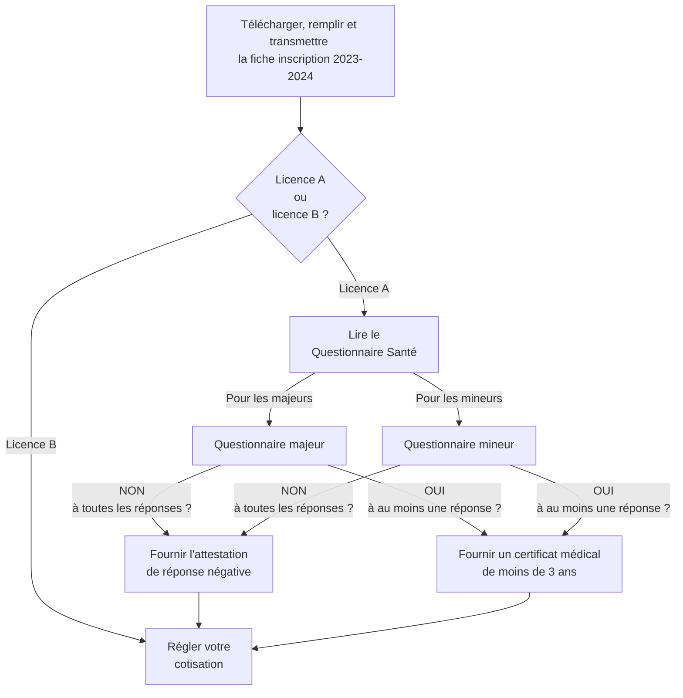

#Première inscription:

+ Télécharger et remplir la [fiche inscription 2023-2024](resources/Fiche-inscription-2023-2024.docx)
+ Remettre la fiche d'inscription remplie à **Gérard Masson** ou **Jean-Pierre Le Gléau** au club

#Première présentation:

+ Télécharger, remplir et transmettre la [fiche inscription 2023-2024](resources/Fiche-inscription-2023-2024.docx)

+ Pour une licence A (compétition):
    + Lire le Questionnaire Santé relatif [aux majeurs](resources/2-questionnaire_majeur.pdf) ou [aux mineurs](resources/2-questionnaire_mineur.pdf)
        + Si __NON__ à toutes les réponses, fournir [l'attestation de réponse négative](resources/2-Attestation_negative.pdf)
        + Si __OUI__ à au moins une réponse, fournir un __certificat médical de moins de 3 ans__.

  Si le certificat médical a été établi il y a <strong>2 ans</strong> pour une autre activité sportive, il est également <strong>valable</strong> !.

+ [Régler votre cotisation](cotisation.md)

#Deuxième présentation:

+ Télécharger, remplir et transmettre la [fiche inscription 2023-2024](resources/Fiche-inscription-2023-2024.docx)

<ul class="nav nav-tabs" role="tablist">
  <li class="nav-item" role="presentation">
    <a class="nav-link active" data-bs-toggle="tab" href="#licenceA" aria-selected="true" role="tab">Licence A</a>
  </li>
  <li class="nav-item" role="presentation">
    <a class="nav-link" data-bs-toggle="tab" href="#licenceB" aria-selected="false" role="tab" tabindex="-1">Licence B</a>
  </li>
</ul>

  

<li> Lire le Questionnaire Santé relatif <a href="./../resources/2-questionnaire_majeur.pdf">aux majeurs</a> ou <a href="./../resources/2-questionnaire_mineur.pdf">aux mineurs</a></li>
<li> Si <strong>NON</strong> à toutes les réponses, <a href="./../resources/2-Attestation_negative.pdf">l'attestation de réponse négative</a></li>
<li> Si <strong>OUI</strong> à au moins une réponse, fournir un <strong>certificat médical de moins de 3 ans</strong>.</li>

 

  Si le certificat médical a été établi il y a <strong>2 ans</strong> pour une autre activité sportive, il est également <strong>valable</strong> !.

<li> <a href ="./../cotisation">Régler votre cotisation</a></li>

  

  

<li> Vous n'avez pas besoin de lire le questionnaire de santé.</li>
<li> <a href ="./../cotisation">Régler votre cotisation</a></li>
  

#Troisième présentation:

