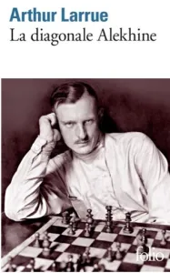
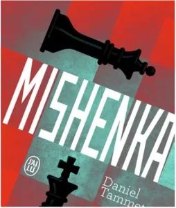
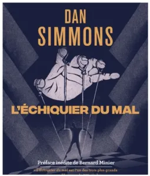
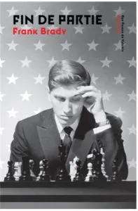
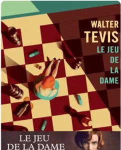

Voici une liste d’œuvres littéraires que le Petit Roque vous recommande :

+ Joueur d’échecs, de Maxime Vachier-Lagrave, Ed. Fayard

+ La diagonale Alekhine, de Arthur Larrue, Ed. Gallimard

+ Mishenka, de Daniel Tammet, Ed. Les arenes

+ Mat, de Ronan Bennett, Ed. Pocket

+ L’échiquier du mal, Tomes 1 & 2, de Dan Simmons, Ed. Folio Science-Fiction

+ Fin de partie, de Frank Brady, Ed. Les Editions aux Forges de Vulcain

+ Le tableau du Maître flamand, de Arturo Perez-Reverte, Ed. Le Livre de Poche

+ Le joueur d’échecs, de Stefan Zweig, Ed. Le livre de Poche

+ La défense Loujine, de Vladimir Nabokov, Ed. Folio

+ Le Jeu de la Dame, de Walter Tevis, Ed. Gallmeister

+ La joueuse d’échecs, de Bertina Henrichs, Ed. Le livre de Poche

+ Le coup du fou, de Alessandro Barbaglia, Ed. Babelio

Bonne lecture !