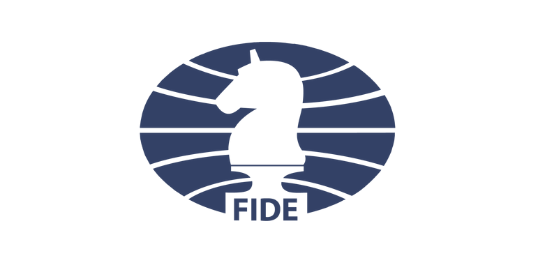

# Fédération Internationale des Echecs (FIDE)
 

  <a href="http://www.fide.com/">
  

    <h5 class="card-title">Site de la FIDE</h5>
  

</a>

 

<a href="https://ratings.fide.com/calculators.phtml">Calculer son classement ELO</a>
 

# Fédération Française des Echecs (FFE)
 

  <a href="http://www.echecs.asso.fr/">
  

    <h5 class="card-title">Site de la FFE</h5>
  

</a>

 

# Ligue de l'Ile de France des Echecs
 

  <a href="http://www.idf-echecs.com/">
  

    <h5 class="card-title">Site de la ligue Ile-de-France des Echecs</h5>
  

</a>

 

# Partenaires du club
 

  <a href="https://www.hauts-de-seine.fr/">
  

    <h5 class="card-title">Site du Conseil Général des hauts de Seine (92)</h5>
  

</a>

 
+ <a href="https://www.hauts-de-seine.fr/">Conseil Général des Hauts-de-Seine (92)</a>
 

  <a href="https://www.sevres.fr/">
  

    <h5 class="card-title">Site de la Mairie de la ville de Sèvres</h5>
  

</a>

 
+ <a href="https://www.sevres.fr/">Mairie de la ville de Sèvres</a>
